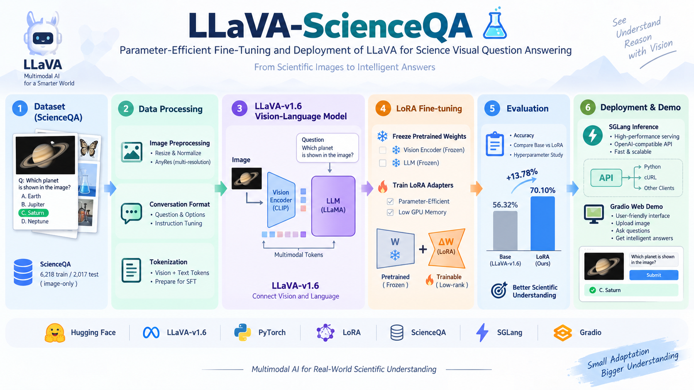
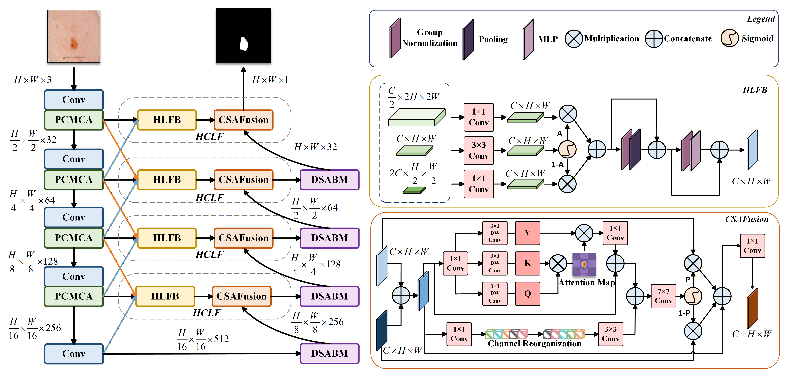
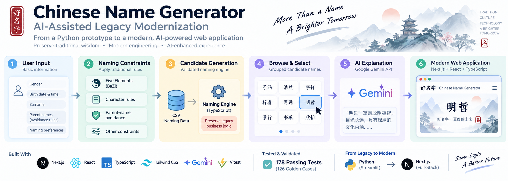

# Hi, I'm Yushen Ding 👋

M.S. student in Electrical and Computer Engineering (Machine Learning and Data Science) at USC, focused on AI/ML engineering, multimodal AI, and computer vision.

Currently seeking Summer 2027 internships in AI/ML Engineering, Agentic AI, Multimodal AI, and Computer Vision.

## 🔥 Featured Projects

### [Agentic Driving Video Understanding with Qwen2.5-VL](https://github.com/ethandingsc/Agentic-Driving-Video-Understanding-with-Qwen2.5-VL) · *Sep 2026*

  

* Fine-tuned **Qwen2.5-VL-7B with LoRA** for multi-frame driving-video understanding, improving **MCQ Accuracy from 76.40% to 81.62%** and **Lingo-Judge from 61.71% to 73.74%**
* Evaluated **Uniform / Dense / Event-aware temporal sampling** and found that dense sampling can lose long-range temporal context despite capturing more local motion
* Built a **LangGraph agent** that uses Qwen2.5-VL as a planner to select safety-critical temporal segments, then performs **local re-sampling and detailed multimodal analysis**
* Integrated lightweight **RAG** for driving-safety knowledge grounding and deployed the fine-tuned model with **SGLang + Gradio**

### [LLaVA Multimodal VQA Fine-Tuning & Deployment](https://github.com/ethandingsc/LLaVA-ScienceQA-LoRA-Fine-Tuning-SGLang-Deployment) · *Aug 2026*

  

* Fine-tuned **LLaVA-v1.6-Vicuna-7B** on ScienceQA using **LoRA**
* Improved accuracy from **56.32% → 70.10% (+13.78 pp)**
* Built an end-to-end inference pipeline with **SGLang, OpenAI-compatible API, and Gradio**

### [GSMBNet — Medical Image Segmentation](https://github.com/ethandingsc/GSMBNet) · *Jun 2025 – Dec 2025*

  

- Designed a cross-scale morphology and boundary modeling network for medical image segmentation
- Conducted **80+ comparative and ablation experiments**
- Achieved **2%+ improvement in mIoU and mDSC** over U-Net baselines on ISIC2017/2018

### [Chinese Name Generator — AI-Assisted Legacy Modernization](https://github.com/ethandingsc/Chinese-Name-Generator-AI-Assisted-Legacy-Modernization) · *Aug 2026*

  

- Modernized a legacy **Python/Streamlit application into Next.js + TypeScript** using a **Claude Code–assisted development workflow**
- Preserved legacy behavior through **126 Golden Tests**, with **178 automated tests** covering migration and regression validation
- Integrated the **Google Gemini API** through server-side API routes for contextual Chinese name explanations

## 💼 Experience

### Traffic Control Technology Co., Ltd. — Deep Learning Data Intern

**Railway Autonomous Driving | Jul 2025 – Aug 2025**

* Worked on visual dataset iteration for **railway autonomous driving**, including data quality analysis, annotation standards, and hard-example mining
* Introduced a **lightweight-model auto-labeling + human review** workflow to improve annotation efficiency
* Analyzed challenging scenarios including **rain/fog, low-light conditions, curves, and small objects** to identify data and detection bottlenecks

### Beijing Limingtang Culture Technology Co., Ltd. — TTS Development Intern

**Speech Cloning | Jun 2024 – Aug 2024**

* Built and processed speech-cloning datasets using **GPT-SoVITS-TTS**, including denoising, segmentation, and normalization
* Improved dataset balance with dialect and noisy-environment samples and tuned training configurations to improve voice-cloning quality

## 🛠️ Technical Skills

**Languages:** Python · C++ · TypeScript  
**ML / DL:** PyTorch · LoRA · CNNs · Transformers · Vision-Language Models  
**Computer Vision:** OpenCV · Image Segmentation · Multimodal Learning  
**AI & Engineering:** SGLang · Gradio · Claude Code · Gemini API · Git · Linux

## 🎓 Education

**University of Southern California**
M.S. Electrical and Computer Engineering — Machine Learning & Data Science

**Relevant Coursework:** EE 503 Engineering Probability · EE 510 Engineering Linear Algebra · EE 541 Deep Learning · EE 559 Machine Learning · CSCI 677 Advanced Computer Vision

**Tiangong University**
B.S. Computer Science and Technology

## 📄 Publications

* **GSMBNet: A Cross-Scale Morpho-Boundary Modeling Network for Medical Image Segmentation** — ICIC 2026, Springer LNCS
* **Enhanced YOLO Optimization Study for Road Sign Detection in Autonomous Driving** — CVIDL 2024, IEEE

## 📫 Contact

📧 [yushending1014@gmail.com](mailto:yushending1014@gmail.com)
